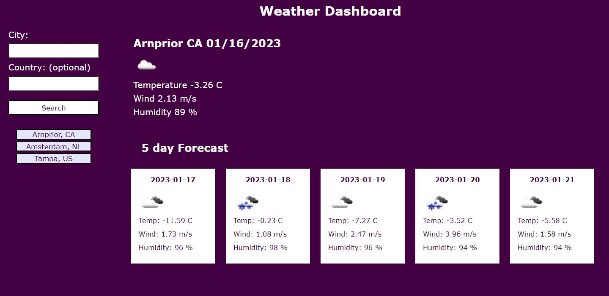

# Weather Dashboard

## Table of Contents
* [About](#about)
* [Screenshot](#screenshot)
* [Link](#link)

## About
--------------------------------------------------------------------------------------------------------------------------------------------------------
This website was created using html, css and javascript to create a weather dashboard for travellers. You can enter any city and it will give you both current and 5 day forcast both including the date, temp, wind, and humidity. Each searched city is stored in localstorage and can be accessed again by clicking the city name. I have included an optional Country field since there are often multiple cities with the same name in different countries. (ie London, BG and London, CA) 

## Screenshot
--------------------------------------------------------------------------------------------------------------------------------------------------------

## Link
-------------------------------------------------------------------------------------------------------------------------------------------------------
Visit the site! [Weather Dashboard](https://teriannephillips.github.io/Weather-Dashboard)